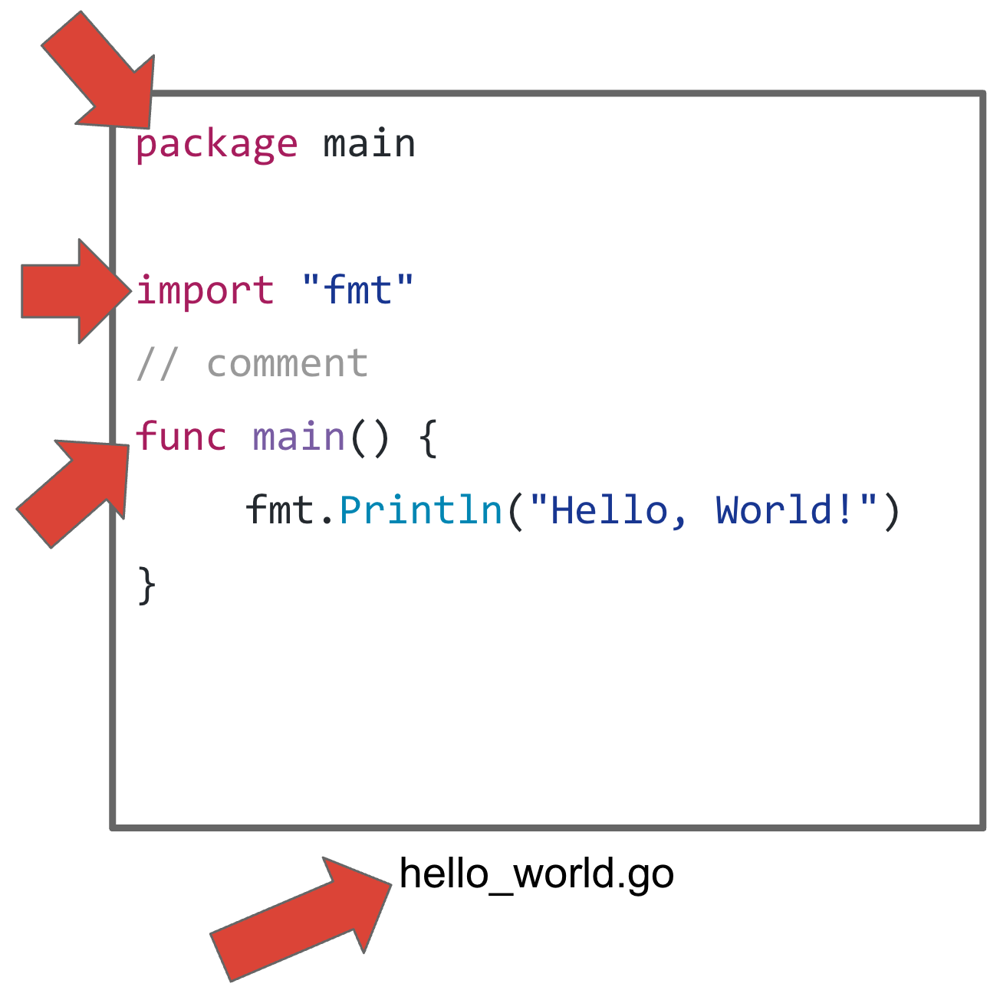

# The Go source file
It is important to understand the make up of a Go source file.  The following figure highlights the major attributes of a Go source file.

#### `package`
All Go source files must start with the he `package` directive.  It declares the name of a package to which the source in the file belongs.  In the source snippet above, the source belongs to package `main` which is a reserved name for packages that get compiled to runnable binaries.  

#### `import`
The `import` statement specifies an  `import path` for packages that are used in the source code.  Your code can import from the standard library or other user-provided packages that are in the workspace.  The code above imports package `fmt` so that it can invoke function `fmt.Println`.

#### `func main()`
Go functions are declared using the `func` keyword.  Function `main` is a special function that is used as the entry point of an executable program.  Function `main` must be defined in the main package.

#### File `hello_world.go`
Go source files can have arbitrary names followed by the `.go` extension.  There is no relations between the code elements in the source file and its name.  However, by convention, the file is usually named something meaningful that is usually kept short and use the underscore (`_`) as word separator.

#### `// Comment`
Go uses C-style comments which are used by Go tools to generate documentation automatically.

## Optional semi-colon
One more thing that is notable in Go sources is the lack of semi-colon.  In idiomatic Go, semi-colons are optional and are always omitted.  However, the Go compiler inserts them during compilation as they are required by Go's formal grammar.

### Next
Read the next section to find out how Go [packages](./packages.md).